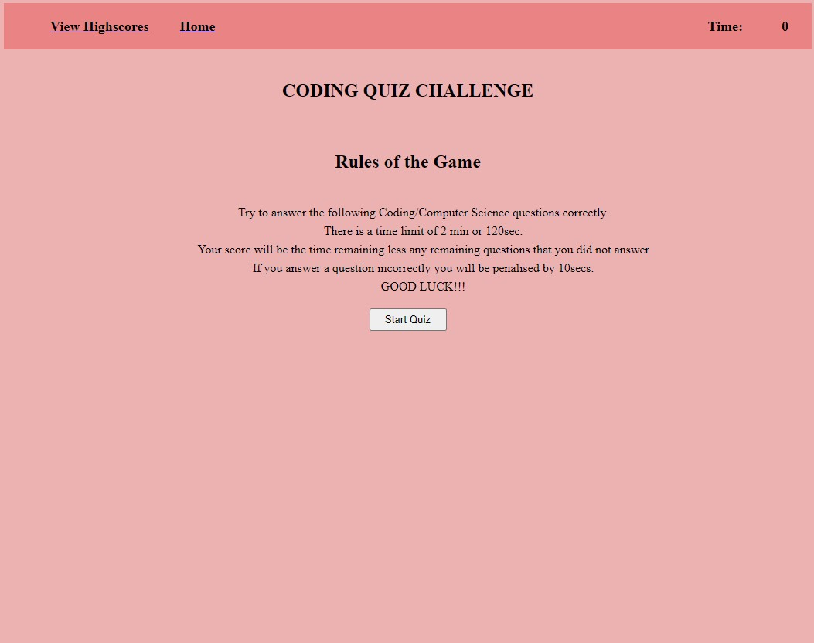
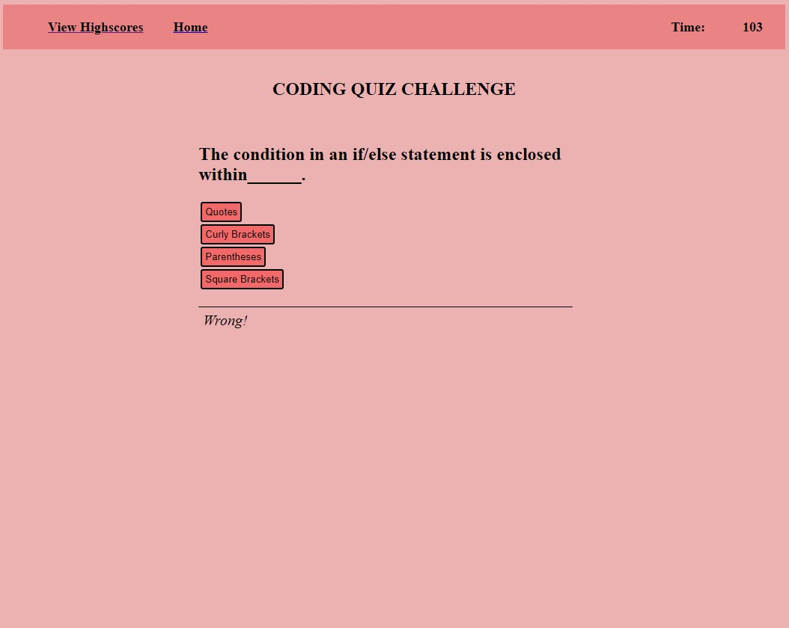
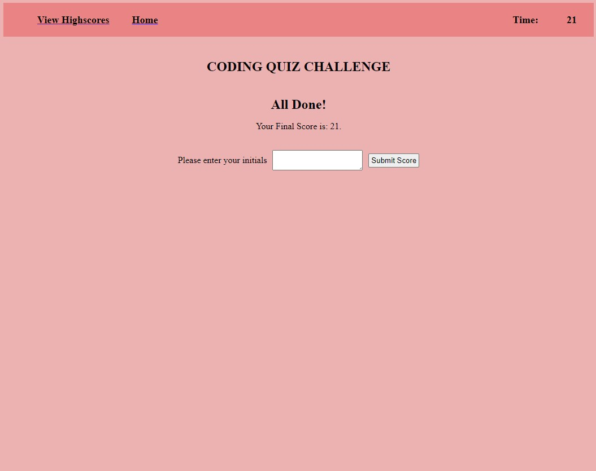

# quiz-time
Quiz Application for Testing Javascript Fundamentals
## Software Application summary
This software is a quiz game that will test your knowledge of Javascript with computer science and javascript based questions. You will be scored by the time remaining left on the timer once the user has finished answering all the questions.

## Inspiration

I had the inspiration to build the Quiz Game application in order to further develop my javascript skills and practice with using web APIs. 

## Updates

I initially updated a standard html template to incorporate the quiz layout and sections. I added the rules to the game and developed a start button to initiate the quiz.
I then created the timer function and called the function in the start button.
I created an array of objects which contained all the questions and answers.
Had some assistance from Sandesh and Nathan in developing the method to display the questions and answers and then cycle through them.
I created a function to test the answer against the option that the user chose. Then added conditional elements to cycle to the next question if correct or deduct 10secs off the timer if the answer selected was incorrect.
Created conditionals to determine when the quiz is finished by either end of questions or timer reaching 0.
Added a huge amount of data attribute adjustments once user clicks on different elements and starts different parts of the quiz game to show and hide different sections and buttons.
Added basic css formatting and styling.
Commented sections of my code in html, css and js files to breakup and distinguish easier the segments of code.
update of file names and links to allow github to display the website while changing repository anem to lowercase and also removing the #'s on the start of the html files.

## Skills and Knowledge learned

I learned a lot from all aspects on this project also, particularly on the design and methodology.

I learnt to create the password generator 2 different ways. One using strings and another using arrays (script.js = Strings and script2.js = Arrays)
Initially I learnt from the design side of the application and how important it was to design the application and have the different components broken down to implement each section simply.
I learnt from the process of deciding whether to use prompts for the user to select the setting or to use the checkboxes and decided upon the checkboxes for multiple reasons; easier for the user to see and decide which setting they want or selected previously and also I found it easier to retrieve those values compared with thsoe stored in the prompts.
Greatly improved my knowledge around functions in Javascript.
solidfied my knowledge on accessing elements from the HTML doc and also adding content back into that element.
solidified mu knowledge around conditional statements. I have some familiarity with them from working with formulas in excel, so wanted to understand how they worked in JS.
Learnt a lot about loops and how they functioned and their power to perform repitive tasks.
Still learning the "grammar" and functioning of JS and how different things interact. Once I get that sorted should help with the design and planning side to understand the best way to implement the app or what is possible and what won't or be too complicated.

## Application Example Images & Videos
### Opening Welcome Screen

### Quiz in Action Screen

### Submit Scores Screen

## Credits
  - (https://www.delftstack.com/howto/javascript/nested-objects-javascript/)[delftstack.com]
  - (https://bobbyhadz.com/blog/javascript-hide-button-after-click/)[bobbyhadz.com]
  - (https://developer.mozilla.org/en-US/docs/Web/JavaScript/Reference/Global_Objects/Array/sort)[Developer-mozilla-Docs]
  - (https://bobbyhadz.com/blog/javascript-cannot-read-property-setattribute-of-null#:~:text=Conclusion%20%23-,The%20%22Cannot%20read%20property%20'setAttribute'%20of%20null%22%20error,the%20DOM%20elements%20are%20created.)[bobbyhadz.com]
  - (https://data-flair.training/blogs/javascript-quiz/)[data-flair.training]
  - (https://www.proprofs.com/quiz-school/story.php?title=pp-mzqxmzy3mwt58y)[www.proprofs.com]
  - (https://developer.mozilla.org/en-US/docs/Web/JavaScript/Reference/Statements/if...else)[Developer-mozilla-Docs]
  - (https://thewebdev.info/2021/08/08/how-to-push-json-objects-into-a-json-array-stored-in-local-storage/#:~:text=To%20push%20JSON%20objects%20into%20an%20array%20in%20local%20storage,push(obj)%3B%20localStorage.)[thewebdev.info]
